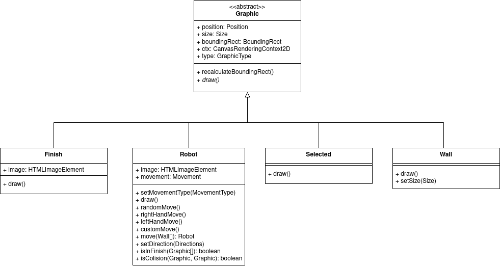

# Wap-2 Robotí bludiště

## Použité technologie
### ReactJS
Jelikož se jedná o jednostránkovou aplikaci, kde se často překresluje pouze jedna část, rozhodli jsme se využít framework ReactJs. Vybrán byl také z důvodu aktuální velké rozšířenosti.

Informační zdroj: [https://react.dev/](https://react.dev/)

### Typescript
Abychom si usnadnili práci s frameworkem ReactJs použili jsme jej s kombinací typescriptu, který nám pomohl se vyvarovat základním chybám.

Informační zdroj: [https://www.typescriptlang.org/docs/handbook](https://www.typescriptlang.org/docs/handbook/intro.html)

## Použité knihovny

### React Bootstrap
Využit pro stylování a vytvoření responsibilního vzhledu. (licence MIT)

Použití: Komponenta `App` importuje css styly a následně jsou použity komponenty poskytnuty Bootstrapem.

Informační zdroj: [https://react-bootstrap.netlify.app/](https://react-bootstrap.netlify.app/)

### React Icons
Využit pro zobrazení ikon v menu. Poskytuje libovolné ikony.

Využity: FontAwesome (licence CC BY 4.0), GameIcons (licence CC BY 3.0)

Použití: Importování jednotlivých komponent, které odpovídají ikonám.

Informační zdroj: [https://react-icons.github.io/react-icons](https://react-icons.github.io/react-icons)

### React Toastify
Využit pro zobrazování informačních a varovných notifikací. (licence MIT)

Použití: Komponenta `App` importuje css styly a vkládá komponentu `ToastContainer`, která se pak zobrazuje pomocí volání metod z `Messages.tsx`.

Informační zdroj: [https://fkhadra.github.io/react-toastify](https://fkhadra.github.io/react-toastify/introduction)

### JsDoc + better-docs
Využit pro vygenerování této dokumentace.

## Externí zdroje
Byly použity následující ikony ze zdroje [flaticon](https://www.flaticon.com/) pro zobrazení jednotlivých grafik:
- Robot: [flaticon/robot](https://www.flaticon.com/free-icon/robot_3570207?term=robot&page=1&position=26&origin=search&related_id=3570207)
- Cíl: [flaticon/finish](https://www.flaticon.com/free-icon/flag_1531222?term=finish&page=1&position=21&origin=search&related_id=1531222)

## Metody pohybů robotů
- Random = Po naražení do překážky zvolí náhodně nový směr, kterým bude robot pokračovat.
- Left Hand = Po naražení do překážky se robot otočí za levou ruku a bude tímto směrem pokračovat.
- Right Hand = Po naražení do překážky se robot otočí za pravou rukou a bude tímto směrem pokračovat.
- Custom = Robot mění směr dle stisknuté klávesy (šipky) na klávesnici, následně tímto směrem pokračuje do dalšího stisknutí klávesy. 

## Objektový návrh grafik
- Veškeré grafiky, které jde vkládat jsou navrhnuty podle následujícího diagramu tříd. To umožňuje snadnou modifikaci (přidání nového typu grafiky s vlastním
chováním)

## Práce jednotlivých členů
- Evžen Gasta = Volba vlastností grafik, pohyb robotů, dokumentace
- David Vlasák = Vkládání grafik, posun grafik, překreslování při pohybu, ukládání/načítání map
